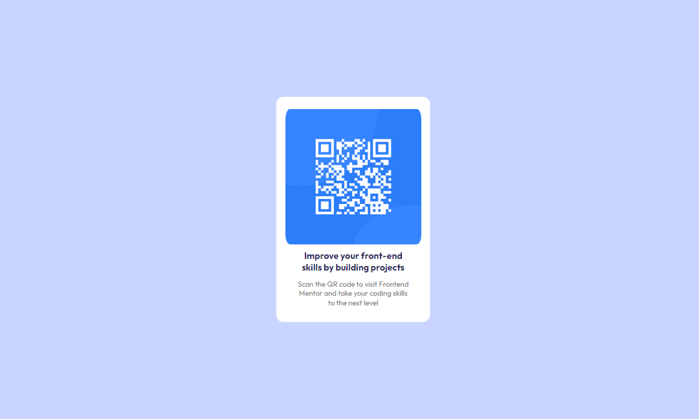

# Frontend Mentor - QR code component solution

This is a solution to the [QR code component challenge on Frontend Mentor](https://www.frontendmentor.io/challenges/qr-code-component-iux_sIO_H). 

## Table of contents

- [Overview](#overview)
  - [Screenshot](#screenshot)
  - [Links](#links)
- [My process](#my-process)
  - [Built with](#built-with)
- [Author](#author)

## Overview

### Screenshot

### Links

- Solution URL: [Add solution URL here](https://your-solution-url.com)
- Live Site URL: [https://zeinaradwan.github.io/Mobile-Desktop-QR/](https://zeinaradwan.github.io/QR-Code-Mobile-and-Desktop/)

## My process

### Built with

- Semantic HTML5 markup
- CSS custom properties
- Flex-box
- Responsive Landing

## Author

- Website - [Zeina Radwan](https://www.your-site.com)
- Frontend Mentor - [@ZeinaRadwan](https://www.frontendmentor.io/profile/ZeinaRadwan)

